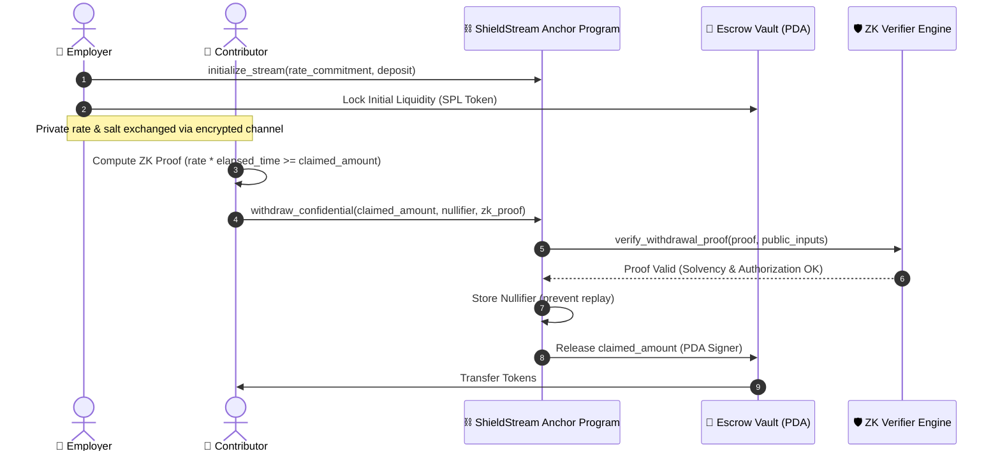

# 🛡️ ShieldStream Protocol

> **Confidential Payment Streaming & Trustless Private Payroll on Solana Powered by Zero-Knowledge Proofs.**  
> *Built for Colosseum Crypto World's Fair 2026 (Solana Track).*

[](https://solana.com)
[](https://noir-lang.org)
[](LICENSE)
[](https://arena.colosseum.org)

---

## ⚡ Executive Summary

Traditional Web3 streaming payment protocols (e.g., Sablier, Superfluid, Zebec) expose every transaction parameter publicly on-chain: exact salary rates, cumulative employee earnings, organizational treasury balances, and individual wallet holdings. This lack of confidentiality makes on-chain payroll practically unusable for enterprise companies, DAOs, and high-profile contributors.

**ShieldStream** solves this privacy-compliance trilemma on Solana:
- **Zero Knowledge Privacy**: Continuous vesting rates and recipient balances remain encrypted off-chain.
- **Mathematical Solvency**: On-chain Anchor smart contracts verify Zero-Knowledge validity proofs (Noir / UltraHonk / BN254) in sub-second execution times without revealing underlying values.
- **Tamper-Proof Anti-Double-Spend**: Unique cryptographic nullifiers prevent double-claiming without linking past withdrawal history.

---

## 🏛️ System Architecture



---

## 📐 Cryptographic Verification Circuit (Noir / UltraHonk)

ShieldStream's off-chain circuit enforces mathematical validity through Poseidon hash commitments:

$$\text{Commitment} = \text{Poseidon}(\text{rate}, \text{salt})$$
$$\text{Unlocked Balance} = \text{rate} \times (\min(\text{now}, \text{stop}) - \text{start})$$
$$\text{Constraint}: \text{Unlocked Balance} \ge \text{Total Withdrawn} + \text{Claimed Amount}$$
$$\text{Nullifier} = \text{Poseidon}(\text{SecretKey}, \text{StreamID}, \text{Nonce})$$

The Solana on-chain verifier confirms the circuit's evaluation vector without learning $\text{rate}$, $\text{salt}$, or $\text{SecretKey}$.

---

## 📂 Repository Layout

```
ShieldStream/
├── programs/
│   └── shield-stream/       # Anchor Solana Smart Contract
│       └── src/
│           ├── lib.rs       # Entrypoints (initialize, deposit, withdraw, pause)
│           ├── state.rs     # PDAs (StreamAccount, NullifierRecord)
│           ├── errors.rs    # Protocol-specific error definitions
│           └── verifier.rs  # On-chain ZK verification binding
├── circuits/
│   └── payroll_proof.nr     # Zero-Knowledge Noir circuit
├── sdk/                     # TypeScript Client SDK for Solana Web3.js
│   └── src/index.ts         # PDA derivations & commitment generators
└── README.md                # Protocol Architecture & Specifications
```

---

## 🚀 Getting Started

### Prerequisites
- [Rust & Cargo](https://rustup.rs/) (>= 1.79.0)
- [Solana CLI](https://docs.solana.com/cli/install-solana-cli-tools) (>= 1.18.0)
- [Anchor CLI](https://www.anchor-lang.com/docs/installation) (>= 0.30.1)
- Node.js (>= 20.x)

### Build Contract
```bash
cd programs/shield-stream
cargo check
```

### SDK Integration
```typescript
import { ShieldStreamClient } from "@shieldstream/sdk";
import { PublicKey } from "@solana/web3.js";

// Derive stream escrow address
const [streamPda] = ShieldStreamClient.getStreamAddress(employerPubkey, 1n);
console.log("Stream PDA:", streamPda.toBase58());
```

---

## 🗺️ Roadmap & Milestones

- [x] **Milestone 1 (Architecture & ZK Circuit)**: Design cryptographic constraint system and state layouts.
- [x] **Milestone 2 (Anchor Contract Core)**: Complete initialize, deposit, confidential withdrawal, and nullifier management.
- [x] **Milestone 3 (Client SDK)**: Deploy TypeScript Web3 client helpers.
- [ ] **Milestone 4 (Devnet Deployment)**: Deploy on Solana Devnet with interactive Next.js dashboard.
- [ ] **Milestone 5 (Colosseum Demo & Audit)**: Finalize pitch video, live demo, and submission for the $250k Colosseum Accelerator cohort.

---

## 👥 Author
* **Ranjeet Kumar Sah** ([@Ranjeet2063](https://github.com/Ranjeet2063))  
  *Full-Stack Web3 & Cryptographic Engineer*  
  *Colosseum Crypto World's Fair 2026 Builder*
