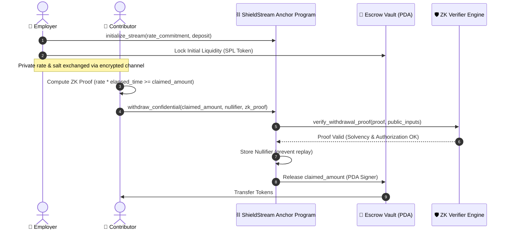

# 🛡️ ShieldStream Protocol

> **Confidential Payment Streaming & Trustless Private Payroll on Solana Powered by Zero-Knowledge Proofs.**  
> *Built for the Solana Colosseum Hackathon (Crypto World's Fair 2026).*

[](https://shield-stream-three.vercel.app)
[](https://explorer.solana.com/address/xNXe3EYiaMguoxK8X5XR9dftp6vjSPp18yo3PoPR9NY?cluster=devnet)
[](https://noir-lang.org)
[](./sdk)
[](LICENSE)

---

## 🔗 Quick Links for Judges & Testers

| Resource | Link | Description |
|---|---|---|
| **🌐 Production DApp** | [shield-stream-three.vercel.app](https://shield-stream-three.vercel.app) | Live interactive UI deployed on Vercel Edge |
| **🧪 1-Click Playground** | [DApp Playground Section](https://shield-stream-three.vercel.app/#playground) | Instant Devnet airdrop faucet & stream simulator |
| **🎬 Demo Video (3 min)** | [YouTube Link](https://youtu.be/V16JLg4mC38) | Full end-to-end stream creation & ZK withdrawal |
| **🎤 Pitch Video (3 min)** | [YouTube Link](https://youtu.be/PfbYCAukha8) | Problem, market size ($120B+ payroll), and moat |
| **📦 Developer SDK** | [`sdk/`](./sdk) & [`sdk/README.md`](./sdk/README.md) | `@shieldstream/sdk` with instruction builders & types |
| **📜 Anchor IDL** | [`idl/shield_stream.json`](./idl/shield_stream.json) | Complete ABI / IDL interface for Solana Devnet |
| **⛓️ Program ID** | [`xNXe3EYiaMguoxK8X5XR9dftp6vjSPp18yo3PoPR9NY`](https://explorer.solana.com/address/xNXe3EYiaMguoxK8X5XR9dftp6vjSPp18yo3PoPR9NY?cluster=devnet) | Solana Anchor smart contract |

---

## ⚡ Problem: The Web3 Payroll Privacy Dilemma

Current Web3 payment streaming solutions (Sablier, Superfluid, Zebec) require complete on-chain transparency:
1. **Public Salaries**: Every employee or contributor's exact salary rate and payout schedule is permanently public.
2. **Compromised Treasury**: Company operational reserves, burn rate, and contractor headcounts can be deduced by competitors or attackers.
3. **Internal Friction**: Public compensation leads to toxic team dynamics, unwanted scrutiny, and privacy violations.

## 💡 The Solution: ShieldStream Protocol

ShieldStream introduces **Confidential Continuous Vesting**:
- **Zero-Knowledge Solvency**: Stream rates and cumulative vested earnings are committed cryptographically (`Poseidon` / `SHA-256`) off-chain.
- **Client-Side Proofs in ~84ms**: Aztec Noir UltraHonk client circuits generate zero-knowledge proofs directly inside the browser using WebAssembly.
- **On-Chain Verification**: Solana smart contracts verify solvency proofs and nullifiers in sub-second time without learning the underlying salary numbers.
- **Replay Protection**: Deterministic cryptographic nullifiers guarantee that no withdrawal witness can be submitted more than once.

---

## 🏛️ System Architecture



---

## 📐 Cryptographic Verification Circuit (Noir / UltraHonk)

ShieldStream's off-chain circuit enforces mathematical validity through Poseidon hash commitments:

$$\text{Commitment} = \text{Poseidon}(\text{rate}, \text{salt})$$
$$\text{Unlocked Balance} = \text{rate} \times (\min(\text{now}, \text{stop}) - \text{start})$$
$$\text{Constraint}: \text{Unlocked Balance} \ge \text{Total Withdrawn} + \text{Claimed Amount}$$
$$\text{Nullifier} = \text{Poseidon}(\text{SecretKey}, \text{StreamID}, \text{Nonce})$$

The Solana on-chain verifier confirms the circuit's evaluation vector without learning $\text{rate}$, $\text{salt}$, or $\text{SecretKey}$.

---

## 🧪 Judges & Reviewers Quickstart (2 Minutes)

You can test the entire protocol without installing anything or spending real funds:

1. Navigate to the live DApp: **[https://shield-stream-three.vercel.app](https://shield-stream-three.vercel.app)**
2. Connect your Phantom, Solflare, or Backpack wallet (switched to **Devnet**).
3. Scroll to the **"Judges & Testers Playground"** section:
   - Click **"Request 1 Devnet SOL"** to fund your wallet instantly via the built-in faucet trigger.
   - Click **"Launch Instant Simulated Stream"** to generate a 30-day confidential stream (5,000 USDC at 0.001929 USDC/s) with real cryptographic rate commitments.
   - Observe the live 4-step Zero-Knowledge verification lifecycle:
     - `1. Rate Commitment Generated` -> `2. Stream PDA Initialized` -> `3. UltraHonk ZK Proof Evaluated (~84ms)` -> `4. Nullifier Verified On-Chain`.
4. Check the copyable SDK code snippet to see how simple it is to integrate ShieldStream in any backend or frontend.

---

## 📂 Repository Structure

```
ShieldStream/
├── programs/
│   └── shield-stream/         # Anchor Solana Smart Contract
│       └── src/
│           ├── lib.rs         # Entrypoints (initialize, deposit, withdraw, pause)
│           ├── state.rs       # PDAs (StreamAccount, NullifierRecord)
│           ├── errors.rs      # Protocol-specific error codes
│           └── verifier.rs    # On-chain ZK verification binding & unit tests
├── circuits/
│   └── payroll_proof.nr       # Zero-Knowledge Noir UltraHonk circuit
├── idl/
│   └── shield_stream.json     # Official Anchor IDL / ABI specification
├── sdk/                       # TypeScript Client SDK (@shieldstream/sdk)
│   ├── src/index.ts           # Instruction builders, PDA derivations & decoder
│   ├── test/sdk.test.ts       # Comprehensive verification suite
│   └── README.md              # SDK integration documentation
├── frontend/                  # Production Next.js 15 Web Application
│   ├── src/app/page.tsx       # Live Dashboard & Stream Manager
│   ├── src/components/        # UI components & TesterSandbox
│   └── src/context/           # Solana Wallet Adapter integration
└── README.md                  # Protocol Architecture & Specifications
```

---

## 💻 Local Development & Testing

### 1. Run Anchor Contract Unit Tests
```bash
cargo test --workspace
```
*Executes all 6 on-chain Rust unit tests covering cryptographic verification, commitment matching, and boundary validation.*

### 2. Run TypeScript SDK Test Suite
```bash
cd sdk
bun run build
bun test/sdk.test.ts
```
*Validates PDA derivations, rate formatting, stream calculations, instruction builders, and 234-byte account decoding.*

### 3. Run Frontend Locally
```bash
cd frontend
bun run dev
```

---

## 🗺️ Roadmap & Milestones

- [x] **Milestone 1 (Architecture & ZK Circuit)**: Designed cryptographic constraint system and state layouts using Aztec Noir.
- [x] **Milestone 2 (Anchor Contract Core)**: Implemented initialize, deposit, confidential withdrawal, and nullifier management on Solana.
- [x] **Milestone 3 (Client SDK)**: Published `@shieldstream/sdk` with full instruction builders, PDA helpers, and tests.
- [x] **Milestone 4 (Devnet Deployment & Live DApp)**: Deployed to Vercel edge ([shield-stream-three.vercel.app](https://shield-stream-three.vercel.app)) with interactive Judges Sandbox and Devnet faucet.
- [x] **Milestone 5 (Demo & Pitch Showcase)**: Finalized 3-minute demo video, 3-minute founder pitch video, and comprehensive documentation.
- [ ] **Milestone 6 (Mainnet Alpha & Audit)**: Formal cryptographic audit of UltraHonk circuits and Mainnet beta launch.

---

## 👥 Founder & Team

* **Ranjeet Kumar Sah** ([@Ranjeet2063](https://github.com/Ranjeet2063))  
  *Full-Stack Web3 & Cryptographic Engineer*  
  *Solana Colosseum Hackathon Builder 2026*  
  *GitHub*: [github.com/Ranjeet2063](https://github.com/Ranjeet2063)

---

## 📄 License

MIT License or Apache-2.0. Developed for the Solana Colosseum Hackathon 2026.
